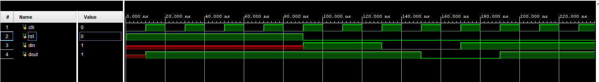
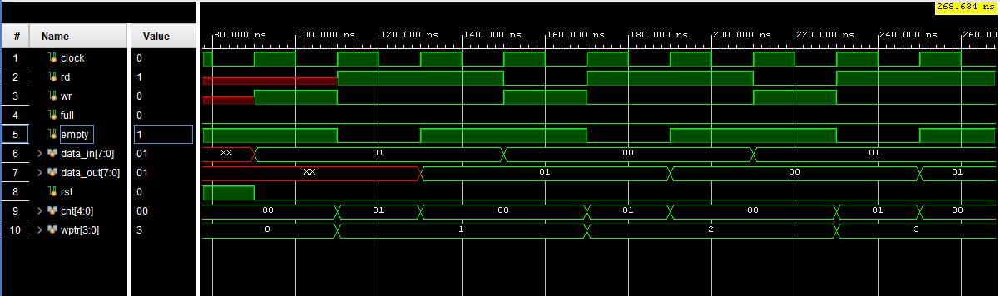

# IPs Verification Testbench (SystemVerilog)

## Get Start
  - Download Vivado Editor: https://www.xilinx.com/support/download.html
  - On Vivado Editor, Create new project
  - Add src file and test bench file in src and test folder to project by press Alt + A
  - Run simulator and see results 

## Description 
  - The project demonstrates how to build a SystemVerilog testbench for verifying a IP design. It focuses on functional verification principles rather than just simulation, showcasing how industry-standard verification methodologies can be applied even to a small DUT (Design Under Test).

## Key Features 
- **Modular Testbench Architecture**
  - Transaction, Generator, Driver, Monitor, Scoreboard, and Environment classes.
- **Transaction-based Verification**
  - Stimulus and response captured in transaction objects for reusability.
- **Mailbox & Event Synchronization**
  - Mailboxes connect generator, driver, monitor, and scoreboard.
  - Events used for synchronization between processes.
- **Clock & Reset Generation**
  - Proper reset sequencing and synchronized at fixed clock.
- **Waveform Debugging**
  - VCD dump support to analyze signals visually.
- **Scalability**
  - Structure can be extended to more complex IPs (e.g., counters, FIFOs, memory).

## Learning Goals 
- Understand **SystemVerilog simulation phases** (active, NBA, etc.).
- Learn how to build **interface-driven testbenches**.
- Gain a foundation for **scaling verification environments** to larger designs.

## Design under test(DUT).
- **Flip-Flop IP** with:
  - `din` : input data
  - `dout`: output data
  - `clk` : clock input
  - `rst` : synchronous reset

## Project Structure
```
└── 📁ip_unit_testing
    └── 📁src
        ├── flip_flop.sv
    └── 📁test
        ├── test_flip_flop.sv
    ├── .gitignore
    ├── image-1.png
    ├── README.md
```

## Waveform Description
  - **For Flip-Flop IP**:
      - **Clock (`clk`)**: toggles every 10 ns (50 kHz frequency).
      - **Reset (`rst`)**: asserted high for 5 cycles, then de-asserted before tests start.
      - **Input (`din`)**: random stimulus generated by the **Generator**.
      - **Output (`dout`)**: driven by the DUT, monitored and sent to the **Scoreboard**.
      - **Events & Transactions**:  
          - After each input stimulus, the Scoreboard compares expected (`din`) vs actual (`dout`).  
          - Results are displayed as `[SCO] PASS` or `[SCO] FAIL`.  

      **Flip Flop Waveform view**:
      

  - **For FIFO IP**:
      - **Clock (`clock`)**: toggles every 10 ns (50 kHz frequency).
      - **Reset (`rst`)**: asserted high for 5 cycles, then de-asserted before tests start.
      - **Input (`data_in`)**: random stimulus generated by the **Generator**.
      - **Output (`data_out`)**: driven by the DUT, monitored and sent to the **Scoreboard**.
      - **Write Enable (`wr`)**: enable writting data to FIFO through `data_in`
      - **Read Enable (`rd`)**: enable reading data to FIFO through `data_out`
      - **FIFO full (`full`)**: flag notify that FIFO is full
      - **FIFO empty (`empty`)**: flag notify that FIFO is empty
      - **Events & Transactions**:  
          - After each input stimulus, the Scoreboard compares expected (`data_in`) vs actual (`data_out`).  
          - Results are displayed as `[SCO] PASS` or `[SCO] FAIL`.

      **FIFO Waveform view**:
      
