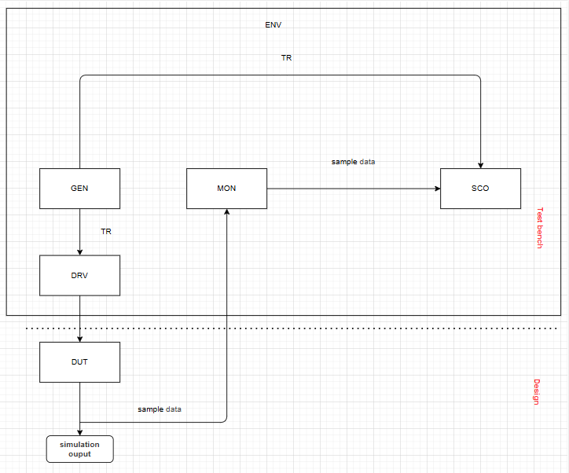

# Testbench Architecture

- Test bench designed according to UVM-lite form, following the classical layered testbench architecture:  
  - **GEN (Generator)** – creates high-level *transactions* (stimulus data) with configurable constraints.  
  - **DRV (Driver)** – converts abstract transactions into *pin-level activities* and drives them into the DUT interface.  
  - **MON (Monitor)** – passively observes DUT signals, extracts transactions, and sends them to higher layers for checking.  
  - **SCO (Scoreboard)** – compares DUT output against expected results, enabling *self-checking verification*.  
  - **ENV (Environment)** – ties all components together, ensuring smooth communication and data flow between GEN, DRV, MON, and SCO.  

## Test architecture diagram

